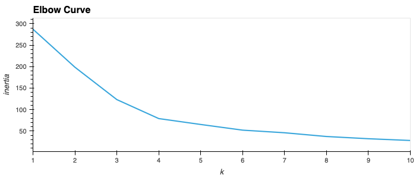
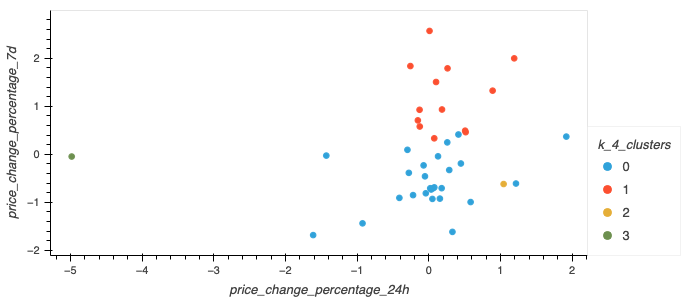
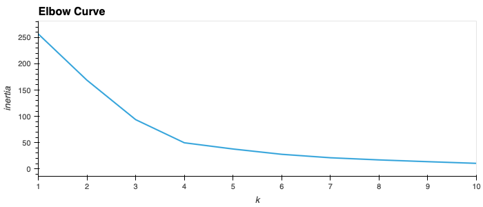
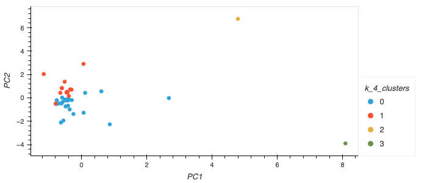

# Module 19 Challenge

## 
Purpose
 

To use Python and unsupervised learning to predict if cryptocurrencies are affected by 24-hour or 7-day price changes.
 

## 
Process & Plots
 

- The `StandardScaler()` module from `scikit-learn` is used to normalize the data.
- Using the elbow method for the original scaled data with a possible k-value from 1 to 10, the best value for `k` is found to be `4`.
    - <ins>Screenshot of Elbow Plot</ins>:   

- The original scaled data is clustered using `KMeans` with the x-axis as "price_change_percentage_24h" and the y-axis as "price_change_percentage_7d."
    - <ins>Screenshot of Clusters</ins>:   

- Using the original scaled data, a `Pricipal Component Analysis (PCA)` is performed to reduce the features to three principal components.
    - The total explained variance for the data is `0.895031657030984`.
- Using the elbow method for the PCA data with a possible k-value from 1 to 10, the best value for `k` is found to be `4`.
    - <ins>Screenshot of Elbow Plot</ins>:   

- The PCA data is clustered using `KMeans` with the x-axis as "PC1" and the y-axis as "PC2."
    - <ins>Screenshot of Clusters</ins>:   

 

## 
References

Data for this dataset was generated by edX Boot Camps LLC, and is intended for educational purposes only.  📚  
 
 
 
       